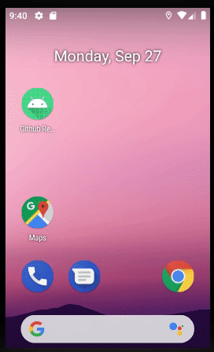

# Projeto Github Data Repositories
-----------

Esse app foi desenvolvido em Kotlin no Android Studio. Neste o usúario pode vizualizar uma lista com informações sobre alguns repositórios no Github.

## Bibliotecas utilizadas para o desenvolvimento:
- Glide: fornece suporte a GIF animado e lida com o carregamento/armazenamento de imagens;
- Retrofit: fornece estrutura para o envio de solicitações de rede http para a API;
- Moshi: para serializar e deserializar os dados na resposta da api;
- EasyFlipView: animação de flip dos card em suporte a recycleview;
- Espresso: api de testes UI Android;
